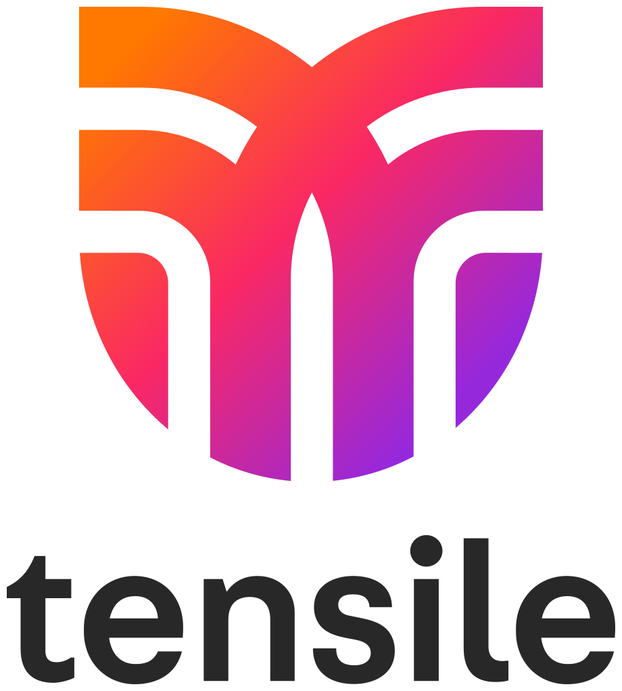

# Tensile

# A Modern Enterprise Auth Framework

Tensile was born out of the need to have a modern, easy to use, highly available, and scalable auth (Passwordless, OAuth, M2M, and SAML) framework for the enterprise. It is designed to be easily extensible and maintainable. It is so easy you can be up and running in minutes. 🎉

🚨 WARNING: This is a work in progress and is not ready for use yet. Please use when we hit 1.0.0!

## Features
* Passwordless Auth via Email / Text
* M2M / JWT built in by default
* SAML 2.0 Support for Enterprise
* OAuth Providers - Google, Github, Microsoft, Apple
* Pluggable Auth Providers
* Architected for Performance and Availability
* Customizable Login Templates
* Webhooks and Eventing
* Multiple Email Providers
* Multiple Text Providers
* MFA via Device / Email / Text
* MFA Recovery Codes
* Robust Rest API for Management
* Advanced Caching via Keyv / Cacheable
* Maintained Monthly

## Contributing and Code of Conduct
Please see [CONTRIBUTING](CONTRIBUTING.md) for details. Please see [CODE_OF_CONDUCT](CODE_OF_CONDUCT.md) for details.

## License
MIT - see [LICENSE](LICENSE) for details

